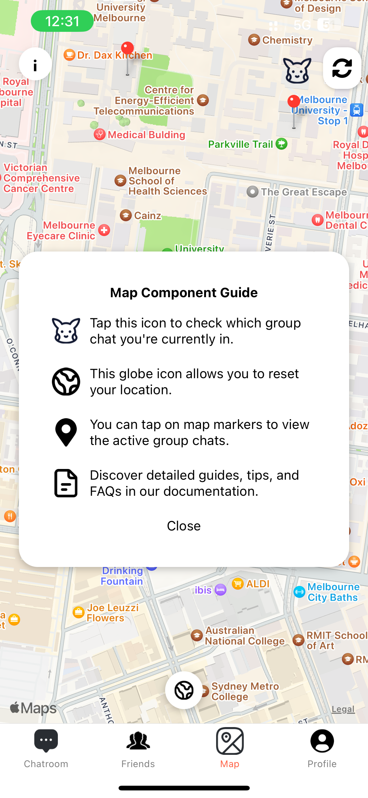
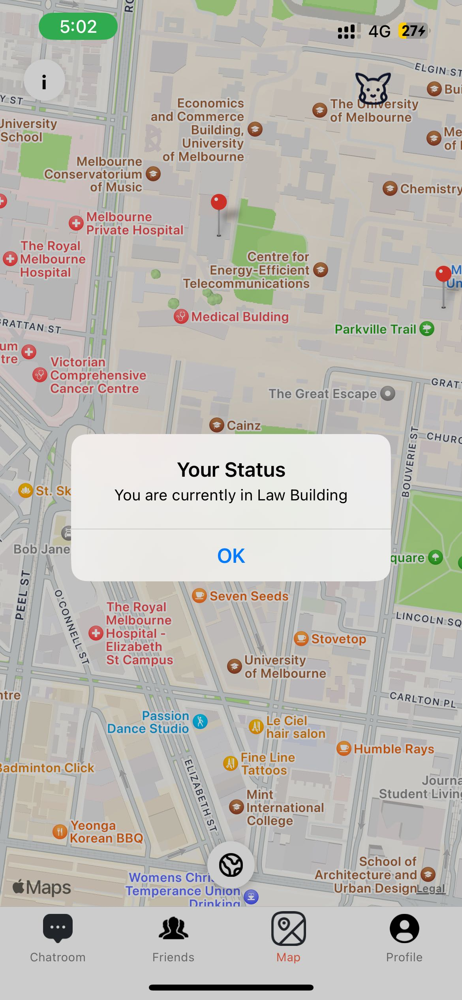
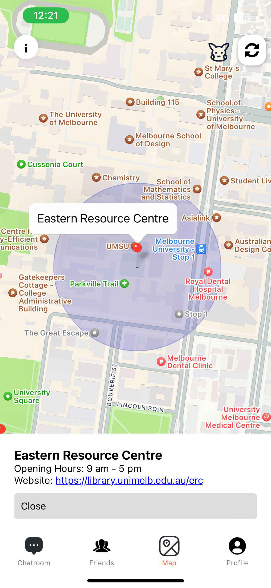
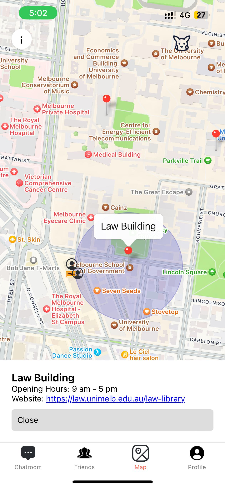

<p align="center">
  
</p>


<p align="center">
  <a href="https://github.com/Author1GitHub" style="margin-right: 30px;">Lujie Ma</a> &nbsp;&nbsp;
  <a href="https://github.com/Dreamer-T" style="margin-right: 30px;">Tianle Zhou</a> &nbsp;&nbsp;
  <a href="https://github.com/fcxsdyb" style="margin-right: 30px;">Yuhang Zhou</a> &nbsp;&nbsp;
  <a href="https://github.com/Seulttom" style="margin-right: 30px;">Yibo Huang</a> &nbsp;&nbsp;
  <a href="https://github.com/ignacio-urrutia">Ignacio Urrutia Gajardo</a>
</p>


## Video（Youtube）
<a href="https://www.youtube.com/watch?v=35nFRYOBuS8" target="_blank"></a>


## Getting Started

To get the project up and running on your local machine, follow these steps:

1. **Install dependencies:**
    ```bash
    yarn install
    ```

 2. **Start the development server:**
     ```bash
     yarn start
     ```

Now you should have the development server running and can start exploring the project!

## Documentation

- [Change Log](CHANGELOG.md): Keep track of updates and changes made to ChatterMap.
- [Tech Spec](https://chattermap.notion.site/Tech-Spec-7a4f390044de40dcafd913281694b1cf?pvs=4): Detailed technical information about ChatterMap's design and architecture.
- [History](history.md): Review the development history and major updates of ChatterMap.
- [Tasks](https://chattermap.notion.site/37bb4c012cc04b3eb8813f6a3261baf5?v=990421b1c3e843ecb08af42ce728afa4&pvs=4): See what tasks are being worked on and what has been completed.
- [Guide](https://xiaolinzzz.notion.site/Guide-to-Open-Chatrooms-3ee45b4f037b4c3f8cfd62a6fe875303?pvs=4): The guide of how you use the chatter map.

## screenshots
<p align="center">
   &nbsp;&nbsp;
   &nbsp;&nbsp;
   &nbsp;&nbsp;
   &nbsp;&nbsp;
</p>


## Backend

You can find the backend repository [here](https://github.com/ignacio-urrutia/MyApp-backend).

## License

This project is licensed under the MIT License - see the [LICENSE.md](LICENSE.md) file for details.
